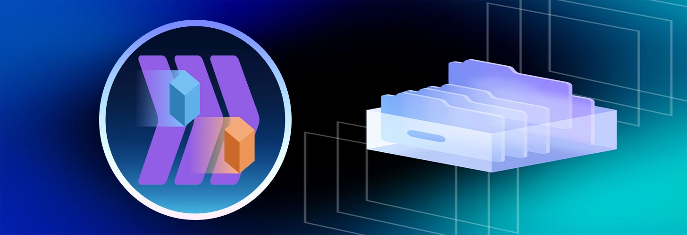

# Extraction Point

Опен сорс приложение под windows для резервного копирования и переноса файлов между дисками или директориями.

# Стек технологий

<div align="center" style="display: flex; align-items: center;">
  <span style="margin: 0 10px; font-size: 24px;"> </span>
  
  <span style="margin: 0 10px; font-size: 24px;"> </span>
  
  <span style="margin: 0 10px; font-size: 24px;"> </span>
  
  <span style="margin: 0 10px; font-size: 24px;"> </span>
  
  <span style="margin: 0 10px; font-size: 24px;"> </span>
  
  <span style="margin: 0 10px; font-size: 24px;"> </span>
</div>

# Установка

Перейти в раздел [релиз](https://github.com/Nevionn/Extraction-point/releases) и скачать исполняемый файл

# Установка из исходников

## Зависимости

- Node.js: v22.x или выше ([Установить](https://nodejs.org/en))
- Rust ([Установить](https://rust-lang.org/tools/install/))

```bush
git clone https://github.com/Nevionn/Extraction-point.git

cd Extraction-point

pnpm install

pnpm tauri dev
```

# ССЫЛКИ ❤️

[](https://t.me/ancient_nevionn)
[](https://www.donationalerts.com/r/nevion)
